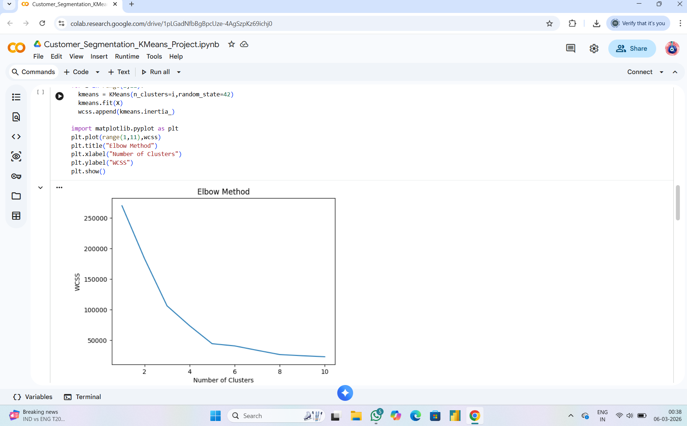
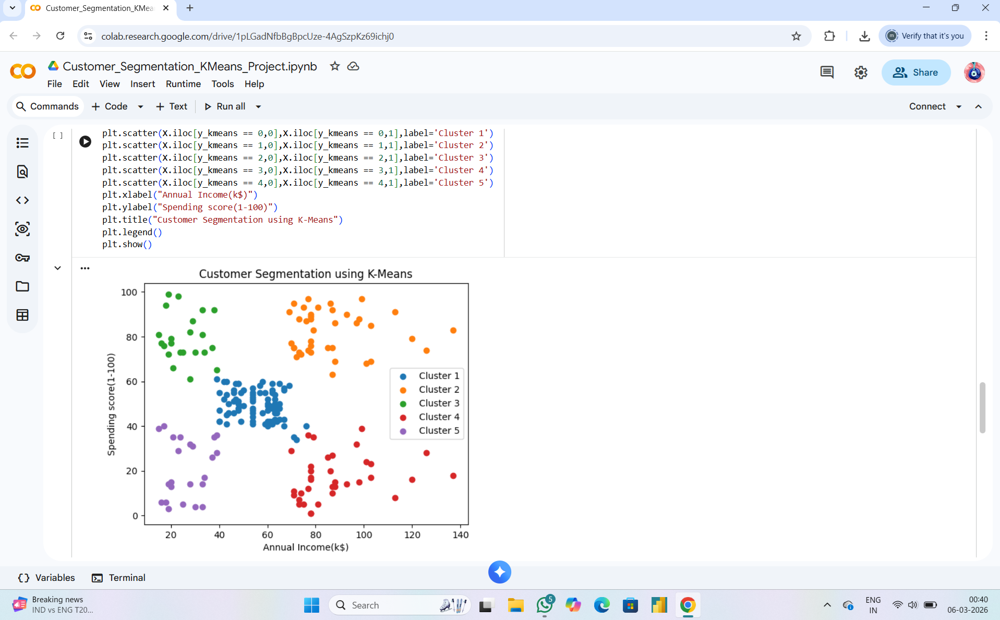

# Customer Segmentation using K-Means Clustering

## Project Overview
This project performs customer segmentation using K-Means clustering to identify different groups of customers based on their purchasing behavior.

## Dataset
Mall Customers dataset containing:
- Customer ID
- Gender
- Age
- Annual Income
- Spending Score

## Technologies Used
- Python
- Pandas
- NumPy
- Matplotlib
- Scikit-Learn

## Steps Performed
1. Data preprocessing
2. Elbow Method to determine optimal clusters
3. K-Means clustering implementation
4. Visualization of customer segments

## Results
Customers were divided into clusters based on spending behavior and income levels, helping businesses identify target marketing groups.

## Visualizations

### Elbow Method

### Customer Segmentation Clusters

## Project Files
- Customer_Segmentation_KMeans_Project.ipynb
- Mall_Customers.csv
- Elbow Method Visualization
- Customer Segmentation Plot
